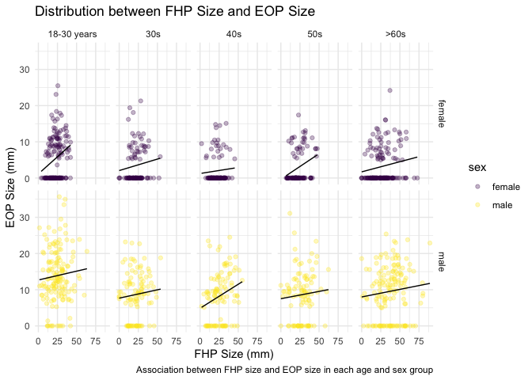

p8105\_mtp\_yc4018
================
Yuxuan Chen
10/28/2021

## Introduction

## Problem 1 – Data.

``` r
library(tidyverse)
library(patchwork)

#set the theme of all graphs
theme_set(theme_minimal() + theme(legend.position = "right"))

#set color of all graphs
options(
  ggplot2.continuous.colour = "viridis",
  ggplot2.continuous.fill = "viridis"
)

scale_colour_discrete = scale_colour_viridis_d
scale_fill_discrete = scale_fill_viridis_d
```

1.  load, clean, and tidy the mtp\_df data

``` r
# Based on the article, the ages were divided into age groups of 18–30, 31–40, 41–50, 51–60, and >61.

mtp_df = readxl::read_excel("./data/p8105_mtp_data.xlsx", range = "A9:I1230") %>%  #read the table without header info
  janitor::clean_names() %>% 
  mutate(
    sex = recode(sex, `1` = "male", `0` = "female"),
    eop_size_mm = if_else(is.na(eop_size_mm), 0, eop_size_mm), # replace NA with 0 in `eop_size_mm` variable. 
    age = as.integer(age),
    age_group = case_when(
      age_group %in% c("6","7","8") ~ "6+",
      TRUE   ~ age_group)) %>% 
  rename(eop_size_group = eop_size, 
         fhp_group = fhp_category) %>% 
  mutate(
      age_group = fct_relevel(age_group, "1", "2", "3", "4", "5", "6+"),
      eop_size_group = fct_relevel(eop_size_group, "0", "1", "2", "3", "4", "5"),
      eop_visibility_classification = factor(eop_visibility_classification, levels = c("0", "1", "2")),
      fhp_group = fct_relevel(fhp_group,"0", "1", "2", "3", "4", "5","6", "7")
  )
knitr::kable(mtp_df[0:10,])
```

| sex    | age | age\_group | eop\_size\_mm | eop\_size\_group | eop\_visibility\_classification | eop\_shape | fhp\_size\_mm | fhp\_group |
|:-------|----:|:-----------|--------------:|:-----------------|:--------------------------------|-----------:|--------------:|:-----------|
| male   |  18 | 2          |          14.8 | 2                | 2                               |          3 |          34.7 | 3          |
| male   |  26 | 2          |          17.1 | 3                | 2                               |          3 |          32.9 | 3          |
| female |  22 | 2          |           0.0 | 0                | 1                               |         NA |          28.1 | 2          |
| male   |  20 | 2          |          23.9 | 4                | 2                               |          1 |          11.0 | 1          |
| female |  27 | 2          |           0.0 | 0                | 0                               |         NA |          19.3 | 1          |
| female |  28 | 2          |           7.9 | 1                | 2                               |          2 |          27.6 | 2          |
| female |  17 | 1          |           6.4 | 1                | 2                               |          1 |          30.6 | 3          |
| male   |  21 | 2          |           9.4 | 1                | 2                               |          2 |          27.8 | 2          |
| female |  25 | 2          |           0.0 | 0                | 0                               |         NA |          26.2 | 2          |
| male   |  30 | 2          |          16.5 | 3                | 2                               |          2 |          21.0 | 2          |

-   After loading the dataset, I cleaned up the variable names and
    converted them to lower snake cases. Based on header information, I
    changed the observations of `1` and `0` to `male` and `female`
    respectively, and replaced NA with 0 in `eop_size_mm` variable. Next
    I changed the observations in `age` variable to be integer and
    combined the ages older than 60 as the group of `6+`. I renamed the
    `eop_size` to `eop_size_group`, `fhp_category` to `fhp_group` for
    naming consistency. Lastly, I ordered the factors for
    `age_group`,`eop_size_group`,`eop_visibility_classification`, and
    `fhp_group` variables.

-   The size of the resulting dataset is (1221, 9), which contains 1221
    observations of 9 variables. The key variables are `age_group`,
    `eop_size_group`, `eop_visibility_classification`, and `fhp_group`,
    because all these variables categorized data into different groups
    based on different criteria.

``` r
n_ptcp = mtp_df %>% count()

age_sex_df = 
  mtp_df %>% 
  group_by(age_group, sex) %>%
  mutate(
    age_group = recode(
      age_group, "1" = "<18", "2" = "18–30", "3" = "31–40", "4" = "41–50", "5" = "51–60", "6+" = ">60")) %>% 
  summarize(n_obs = n())

age_sex_df %>% 
  pivot_wider(
    names_from = sex,
    values_from = n_obs) %>% 
  knitr::kable(caption = "Age and Gender Distribution")
```

| age\_group | female | male |
|:-----------|-------:|-----:|
| &lt;18     |      1 |    1 |
| 18–30      |    151 |  152 |
| 31–40      |    102 |  102 |
| 41–50      |    106 |  101 |
| 51–60      |     99 |  101 |
| &gt;60     |    155 |  150 |

Age and Gender Distribution

``` r
age_sex_df %>% 
  ggplot(aes(x = age_group, y = n_obs, group = sex, color = sex)) + 
  geom_point(alpha = .5) +
  geom_line(alpha = .5) +
  labs(
    title = "Scatter Plot of Age Distribution Based on Sex",
    x = "Age group",
    y = "Number of Observations"
  )
```

<!-- -->

-   There are 1221 participants included. Male and female have the
    similar distributions of number of observations in each age group.

2.  Issues in the data:

``` r
y = as.integer(c(18, 31, 41, 51, 61))
class(mtp_df$age)
```

    ## [1] "integer"

``` r
# age:
mtp_df %>% 
  ggplot(aes(x = age_group, y = age, color = age_group)) +
  geom_point(alpha = .5) +
  geom_hline(yintercept = c(18, 31, 41, 51, 61), linetype = 3) +
  labs(
    title = "Scatter Plot of Age Data",
    x = "Age Group (years)",
    y = "Age") +
  scale_x_discrete(
    labels = c("<18", "18–30", "31–40", "41–50", "51–60", ">60")) +
  scale_color_hue(
    labels = c("<18", "18–30", "31–40", "41–50", "51–60", ">60")) +
  annotate("text", x = 0.7, y = 18, label = "y=18", vjust = -1, size = 3) +
  annotate("text", x = 0.7, y = 30, label = "y=31", vjust = -1, size = 3) +
  annotate("text", x = 0.7, y = 41, label = "y=41", vjust = -1, size = 3) +
  annotate("text", x = 0.7, y = 51, label = "y=51", vjust = -1, size = 3) +
  annotate("text", x = 0.7, y = 61, label = "y=61", vjust = -1, size = 3)
```

<!-- -->

``` r
mtp_df %>% 
  filter(age_group == 1) %>% 
  select(age, age_group) %>% 
  knitr::kable()
```

| age | age\_group |
|----:|:-----------|
|  17 | 1          |
|  45 | 1          |

-   There are 2 data placed in the &lt;18 age group, especially one with
    45 age is mistakenly placed in this age group.

``` r
#EOP sizes group
mtp_df %>% 
  ggplot(aes(x = eop_size_group, y = eop_size_mm, color = eop_size_group)) +
  geom_point(alpha = .5) +
  geom_hline(yintercept = c(5, 10, 15, 20, 25), linetype = 3) +
  labs(
    title = "Scatter Plot of EOP Sizes in EOP Sizes Groups",
    x = "EOP Size Group",
    y = "EOP Size (mm)") +
  scale_color_hue(
    name = "EOP size group",
    labels = c("0 = 0-5mm", "1 = 5-10mm", "2 = 10-15mm", "3 = 15-20mm", "4 = 20-25mm", "5 = 25+mm"))
```

<!-- -->

``` r
mtp_df %>% 
  filter(!eop_size_group %in% c("0","1","2","3","4","5")) %>% 
  select(eop_size_group, eop_size_mm) %>% 
  knitr::kable()
```

| eop\_size\_group | eop\_size\_mm |
|:-----------------|--------------:|
| 14.6             |            15 |

-   There is one data with 15mm EOP size was mistakenly placed in 14.6
    size group. Also there are many misclassified data in size groups of
    1, 3, 4, 5.

``` r
#eop_visibility_classification
mtp_df %>% 
  ggplot(aes(x = eop_visibility_classification, y = eop_size_mm, color = eop_visibility_classification)) +
  geom_point(alpha = .5) +
  geom_hline(yintercept = c(5), linetype = 3) +
  labs(
    title = "Scatter Plot of EOP Sizes in EOP Visibility Classification Groups",
    x = "EOP Visibility Classification Group",
    y = "EOP Size (mm)") +
  scale_color_hue(
    name = "EOP size group",
    labels = c("0 = 0mm", "1 = 0-5mm", "2 => 5mm"))
```

<!-- -->

-   There are a lot misclassified data.

``` r
mtp_df %>% 
  drop_na(fhp_size_mm) %>% 
  ggplot(aes(x = fhp_group, y = fhp_size_mm, color = fhp_group)) +
  geom_point(alpha = .5) +
  geom_hline(yintercept = c(10, 20, 30, 40, 50, 60, 70, 80), linetype = 3) +
  labs(
    title = "Scatter Plot of FHP Sizes",
    x = "FHP Size Group",
    y = "FHP Size (mm)") +
  scale_color_hue(
    name = "FHP size group",
    labels = c("0 = 0-10mm", "1 = 10-20mm", "2 = 20-30mm","3 = 30-40mm", "4 = 40-50mm", "5 = 50-60mm", "6 = 60-70mm", "7 = 70-80mm"))
```

<!-- -->

``` r
mtp_df %>% 
  filter(!fhp_group %in% c("0","1","2","3","4","5", "6","7")) %>% 
  select(fhp_group,fhp_size_mm) %>% 
  knitr::kable()
```

| fhp\_group | fhp\_size\_mm |
|:-----------|--------------:|
| 30.8       |          30.3 |

-   There is one data with 30.3mm FHP size was mistakenly placed in 30.8
    size group. Also there are many misclassified data in size groups 1,
    2, and 4.

## Problem 2 – Visualization.

``` r
FHP_plot = 
  mtp_df %>% 
  filter(age_group != 1) %>% 
  drop_na(fhp_size_mm) %>% 
  ggplot(aes(x = age_group, y = fhp_size_mm, fill = sex)) +
  geom_boxplot(alpha = .5) +
  labs(
    title = "FHP Values Across the Age Groups and Sexes",
    x = "Age Group (years)",
    y = "FHP Size (mm)") +
  scale_x_discrete(labels = c("18-30 years", "30s", "40s", "50s", ">60")) + 
  stat_summary(fun = mean, geom = "point", size = 1, position = position_dodge(width = 0.75)) +
  stat_summary(fun.data = mean_se, geom = "errorbar", width = 0.3, position = position_dodge(width = 0.75))

eeop_plot = 
  mtp_df %>% 
  mutate(
    eeop = case_when(
      eop_size_group %in% c("0", "1") ~ "no",
      eop_size_group %in% c("2", "3", "4", "5") ~ "yes",
      TRUE   ~ "")) %>% 
  group_by(age_group, sex, eeop) %>% 
  summarize(n_obs = n()) %>% 
  mutate(rate = prop.table(n_obs)) %>% 
  filter(eeop == "yes") %>% 
  ggplot(aes(x = age_group, y = rate)) + 
  geom_point() +  
  geom_line(aes(group = sex, color = sex))  +
  labs(
    title = "Distribution of the Rate of EEOP In Each Age Group",
    x = "Age Group (years)",
    y = "EEOP prop") +
  scale_x_discrete(labels = c("18-30 years", "30s", "40s", "50s", ">60"))
FHP_plot / eeop_plot
```

<!-- -->

-   Improved fig.3 shows the distribution of FHP data across the age
    groups and sexes. In the 60+ age group, both male and female have
    the highest FHP size. Male has higher FHP sizes than female within
    all age groups since the median of FHP sizes of male are higher.
    Both mean and sd are close to median in each age and sex group.

.  
- Bottom plot shows the distribution of rate of EEOP in each age and sex
group. The trends of distribution in improved fig.4 are similar to the
original plot. Male has higher EEOP rate than female. 18-30 years group
has the highest EEOP rate. With age increases, EEOP rate decreases and
EEOP becomes unlikely to occur. After the age of 40s, EEOP rate slightly
increases

``` r
mtp_df %>%
  filter(age_group != 1) %>% 
  drop_na(fhp_size_mm) %>% 
  ggplot(aes(x = fhp_size_mm, y = eop_size_mm, color = sex)) +
  geom_point(alpha = 0.3) +
  geom_smooth(method = "lm", color = "black", size = 0.5, se = FALSE) +
  facet_grid(
    sex ~ age_group,
    labeller = labeller(age_group = c("2" = "18-30 years", "3" = "30s", "4" = "40s", "5" = "50s", "6+" = ">60s"))) +
  labs(
    title = "Distribution between FHP Size and EOP Size",
    caption = "Association between FHP size and EOP size in each age and sex group",
    x = "FHP Size (mm)",
    y = "EOP Size (mm)")
```

<!-- -->

In both sex groups, EOP size and FHP size have positive relationship in
every age group.

## Problem 3 – Reproducing reported results.

``` r
mtp_df %>% 
  group_by(age_group) %>% 
  summarize(n = n()) %>% 
  mutate(
    age_group = recode(
      age_group, "1" = "<18", "2" = "18–30", "3" = "31–40", "4" = "41–50", "5" = "51–60", "6+" = ">60")) %>% 
  knitr::kable(col.names = c("Age Group", "Sample Size"))
```

| Age Group | Sample Size |
|:----------|------------:|
| &lt;18    |           2 |
| 18–30     |         303 |
| 31–40     |         204 |
| 41–50     |         207 |
| 51–60     |         200 |
| &gt;60    |         305 |

1.  No. The authors’ stated sample size was: 18–30: n = 300, 31–40: n =
    200, 41–50: n = 200, 51–60: n = 200, and &gt;60: n = 300, which is
    different with the data I have.

``` r
mean(pull(mtp_df, fhp_size_mm), na.rm = TRUE) 
```

    ## [1] 26.10134

``` r
mtp_df %>% 
  group_by(sex) %>% 
  summarize(
    mean = mean(fhp_size_mm, na.rm = TRUE),
    sd = sd(fhp_size_mm, na.rm = TRUE)
  ) %>% 
  knitr::kable()
```

| sex    |     mean |       sd |
|:-------|---------:|---------:|
| female | 23.72580 | 10.61789 |
| male   | 28.51234 | 14.66670 |

2.  The reported overall mean FHP was 26 ±mm, for male was 28±15mm, and
    for female was 24±11mm, which are consistent with the data I have
    available.

``` r
mtp_df %>% 
  filter(
    age_group != 1,
    eop_size_group %in% c("0", "1", "2", "3", "4", "5")) %>% 
  mutate(
    eeop = case_when(
      eop_size_group %in% c("0", "1") ~ "no",
      eop_size_group %in% c("2", "3", "4", "5") ~ "yes",
      TRUE   ~ "")) %>% 
  group_by(eeop) %>% 
  summarize(n_obs = n()) %>% 
  mutate(rate = prop.table(n_obs)) %>% 
  knitr::kable()
```

| eeop | n\_obs |      rate |
|:-----|-------:|----------:|
| no   |    825 | 0.6773399 |
| yes  |    393 | 0.3226601 |

3.  EEOP is when the bony outgrowth exceeds 10mm and can be evaluated by
    `eop_size_mm` or `eop_size_group`. The calculated prevalence of EEOP
    equals 32% which is smaller than authors’ finding.

``` r
mtp_df %>% 
  filter(age_group != 1) %>% 
  group_by(age_group) %>% 
  count(fhp_group) %>% 
  mutate(rate = prop.table(n)) %>% 
  filter(fhp_group %in% c('4', '5', '6', '7')) %>% 
  summarize(sum = sum(rate)) %>% 
  knitr::kable(col.names = c("Age Group", "Frequency of FHP >40 mm"))
```

| Age Group | Frequency of FHP &gt;40 mm |
|:----------|---------------------------:|
| 2         |                  0.0660066 |
| 3         |                  0.0588235 |
| 4         |                  0.0869565 |
| 5         |                  0.1100000 |
| 6+        |                  0.3245902 |

4.  The broad trend is consistent with my data, but my frequency of
    FHP&gt;40mm in 60+ age group is 32.5%, which is smaller than the
    finding by author.

## Problem 4 – Discussion.

-   From my calculation, increasing in age resulted increasing in FHP
    size, which is positively related to EOP size. Hence, the high EEOP
    rate in 18-30 years group do recommends a potential avenue for
    prevention intervention through posture improvement education in
    this cohort. However, there are many mistakes in data and many
    misclassified data in original report, which makes the quality of
    the results doubtful. Some calculated values, like prevalence of
    EEOP, are also different with authors’ findings. Even though the
    broad trends of the original report’s conclusions are consistent
    with mine, we cannot conclude that cell phones are causing horn
    growth since poor posture may not directly cause EEOP formation, and
    there may be other poor postures but not just using cell phones.
    Hence, prevalence of top poor postures and time of cell phone usage
    among different age groups may be helpful to address the hypothesis.
