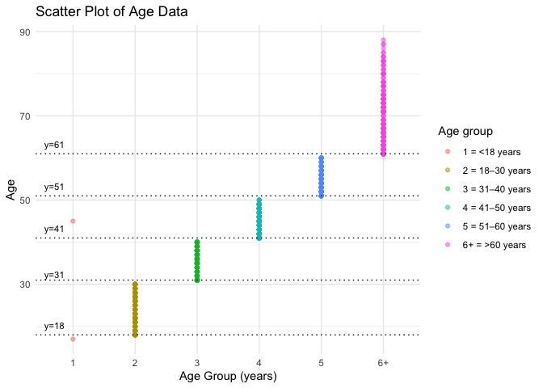
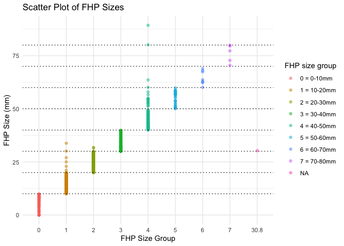

p8105\_mtp\_yc4018
================
Yuxuan Chen
10/28/2021

## Introduction

and four sections corresponding to the problems below

## Problem 1 – Data.

``` r
library(tidyverse)
library(patchwork)

#set the theme of all graphs
theme_set(theme_minimal() + theme(legend.position = "right"))

#set color of all graphs
options(
  ggplot2.continuous.colour = "viridis",
  ggplot2.continuous.fill = "viridis"
)

scale_colour_discrete = scale_colour_viridis_d
scale_fill_discrete = scale_fill_viridis_d
```

1.  load, clean, and tidy the mtp\_df data

``` r
mtp_df = readxl::read_excel("./data/p8105_mtp_data.xlsx", range = "A9:I1230") %>%  #read the table without header information
  janitor::clean_names() %>% 
  mutate(
    sex = recode(sex, `1` = "male", `0` = "female"),
    eop_size_mm = if_else(is.na(eop_size_mm), 0, eop_size_mm), # replace NA with 0 in `eop_size_mm` variable. 
    age = as.integer(age),
    age_group = case_when(
      age_group %in% c("6","7","8") ~ "6+",
      TRUE   ~ age_group)) %>% 
  rename(eop_size_group = eop_size, 
         fhp_group = fhp_category) %>% 
  mutate(
      age_group = fct_relevel(age_group, "1", "2", "3", "4", "5", "6+"),
      eop_size_group = fct_relevel(eop_size_group, "0", "1", "2", "3", "4", "5"),
      eop_visibility_classification = factor(eop_visibility_classification, levels = c("0", "1", "2")),
      fhp_group = fct_relevel(fhp_group,"0", "1", "2", "3", "4", "5","6", "7")
  )
knitr::kable(mtp_df[0:10,])
```

| sex    | age | age\_group | eop\_size\_mm | eop\_size\_group | eop\_visibility\_classification | eop\_shape | fhp\_size\_mm | fhp\_group |
|:-------|----:|:-----------|--------------:|:-----------------|:--------------------------------|-----------:|--------------:|:-----------|
| male   |  18 | 2          |          14.8 | 2                | 2                               |          3 |          34.7 | 3          |
| male   |  26 | 2          |          17.1 | 3                | 2                               |          3 |          32.9 | 3          |
| female |  22 | 2          |           0.0 | 0                | 1                               |         NA |          28.1 | 2          |
| male   |  20 | 2          |          23.9 | 4                | 2                               |          1 |          11.0 | 1          |
| female |  27 | 2          |           0.0 | 0                | 0                               |         NA |          19.3 | 1          |
| female |  28 | 2          |           7.9 | 1                | 2                               |          2 |          27.6 | 2          |
| female |  17 | 1          |           6.4 | 1                | 2                               |          1 |          30.6 | 3          |
| male   |  21 | 2          |           9.4 | 1                | 2                               |          2 |          27.8 | 2          |
| female |  25 | 2          |           0.0 | 0                | 0                               |         NA |          26.2 | 2          |
| male   |  30 | 2          |          16.5 | 3                | 2                               |          2 |          21.0 | 2          |

-   Above is the first 10 rows of the resulting dataset.
-   Data cleaning process: after loading the dataset, I cleaned up the
    variable names and converted them to lower snake cases. Then based
    on header information, in `sex` variable, I changed the observations
    of `1` and `0` to be `male` and `female` respectively, and also
    replaced NA with 0 in `eop_size_mm` variable. Next, I changed the
    observations in `age` variable to be the class of integer. Since
    based on the article, the ages were divided into age groups of
    18–30, 31–40, 41–50, 51–60, and &gt;61, so I combined the ages older
    than 60 as the group of `6+`. Moreover, for naming consistency, I
    renamed the `eop_size` variable to be `eop_size_group`,
    `fhp_category` variable to be `fhp_group`. Lastly, I ordered the
    factors for
    `age_group`,`eop_size_group`,`eop_visibility_classification`, and
    `fhp_group` categorical variables. .
-   The resulting mtp\_df dataset contains 1221 observations of 9
    variables. The size of this dataset is (1221, 9). I think the key
    variables are `age_group`, `eop_size_group`,
    `eop_visibility_classification`, and `fhp_group`, because
    `age_group` variable categorized different ages into 5 groups of
    18–30, 31–40, 41–50, 51–60, and &gt;61, `eop_size_group` variable
    separated EOP sizes into 6 different groups,
    `eop_visibility_classification` represented the sizes of EOP smaller
    than 5mm or larger than 5mm, and `fhp_group` categorized different
    FHP sizes into group based on range of 10mm.

``` r
n_ptcp = mtp_df %>% count()

age_sex_df = 
  mtp_df %>% 
  group_by(age_group, sex) %>%
  mutate(
    age_group = recode(
      age_group, "1" = "<18", "2" = "18–30", "3" = "31–40", "4" = "41–50", "5" = "51–60", "6+" = ">60")) %>% 
  summarize(n_obs = n())

age_sex_df %>% 
  pivot_wider(
    names_from = sex,
    values_from = n_obs) %>% 
  knitr::kable(caption = "Age and Gender Distribution")
```

| age\_group | female | male |
|:-----------|-------:|-----:|
| &lt;18     |      1 |    1 |
| 18–30      |    151 |  152 |
| 31–40      |    102 |  102 |
| 41–50      |    106 |  101 |
| 51–60      |     99 |  101 |
| &gt;60     |    155 |  150 |

Age and Gender Distribution

``` r
age_sex_df %>% 
  ggplot(aes(x = age_group, y = n_obs, group = sex, color = sex)) + 
  geom_point(alpha = .5) +
  geom_line(alpha = .5) +
  labs(
    title = "Scatter Plot of Age Distribution Based on Sex",
    x = "Age group",
    y = "Number of Observations"
  )
```

<!-- -->

-   There are 1221 participants included. Based on the table and the
    scatter plot, we can see that male and female have the similar
    distributions of number of observations in each age group.

2.  Issues in the data:

``` r
y = as.integer(c(18, 31, 41, 51, 61))
class(mtp_df$age)
```

    ## [1] "integer"

``` r
# age:
mtp_df %>% 
  ggplot(aes(x = age_group, y = age, color = age_group)) +
  geom_point(alpha = .5) +
  geom_hline(yintercept = c(18, 31, 41, 51, 61), linetype = 3) +
  labs(
    title = "Scatter Plot of Age Data",
    x = "Age Group (years)",
    y = "Age") +
  scale_x_discrete(
    labels = c("<18", "18–30", "31–40", "41–50", "51–60", ">60")) +
  scale_color_hue(
    labels = c("<18", "18–30", "31–40", "41–50", "51–60", ">60")) +
  annotate("text", x = 0.7, y = 18, label = "y=18", vjust = -1, size = 3) +
  annotate("text", x = 0.7, y = 30, label = "y=31", vjust = -1, size = 3) +
  annotate("text", x = 0.7, y = 41, label = "y=41", vjust = -1, size = 3) +
  annotate("text", x = 0.7, y = 51, label = "y=51", vjust = -1, size = 3) +
  annotate("text", x = 0.7, y = 61, label = "y=61", vjust = -1, size = 3)
```

<!-- -->

``` r
mtp_df %>% 
  filter(age_group == 1) %>% 
  select(age, age_group) %>% 
  knitr::kable()
```

| age | age\_group |
|----:|:-----------|
|  17 | 1          |
|  45 | 1          |

-   Based on the header information, we know that the ages are divided
    into 5 age groups of 18–30, 31–40, 41–50, 51–60, and &gt;61.
    However, based on the above scatter plot of age data, we can see
    that there are 2 points were contained in the group with age smaller
    than 18, and there is one point with age equals to 45 was mistakenly
    placed in this age group.

``` r
#EOP sizes group
mtp_df %>% 
  ggplot(aes(x = eop_size_group, y = eop_size_mm, color = eop_size_group)) +
  geom_point(alpha = .5) +
  geom_hline(yintercept = c(5, 10, 15, 20, 25), linetype = 3) +
  labs(
    title = "Scatter Plot of EOP Sizes in EOP Sizes Groups",
    x = "EOP Size Group",
    y = "EOP Size (mm)") +
  scale_color_hue(
    name = "EOP size group",
    labels = c("0 = 0-5mm", "1 = 5-10mm", "2 = 10-15mm", "3 = 15-20mm", "4 = 20-25mm", "5 = 25+mm"))
```

<!-- -->

``` r
mtp_df %>% 
  filter(!eop_size_group %in% c("0","1","2","3","4","5")) %>% 
  select(eop_size_group, eop_size_mm) %>% 
  knitr::kable()
```

| eop\_size\_group | eop\_size\_mm |
|:-----------------|--------------:|
| 14.6             |            15 |

-   Based on the above scatter plot of EOP sizes, we can see that there
    is one point with EOP size equals to 15 mm was mistakenly placed in
    an individual size group named 14.6. Also, from the graph we can see
    that in the size group of 5-10, 15-20, 20-25, 25+mm, there are many
    points were not in the size ranges that they should be classified
    in.

``` r
#eop_visibility_classification
mtp_df %>% 
  ggplot(aes(x = eop_visibility_classification, y = eop_size_mm, color = eop_visibility_classification)) +
  geom_point(alpha = .5) +
  geom_hline(yintercept = c(5), linetype = 3) +
  labs(
    title = "Scatter Plot of EOP Sizes in EOP Visibility Classification Groups",
    x = "EOP Visibility Classification Group",
    y = "EOP Size (mm)") +
  scale_color_hue(
    name = "EOP size group",
    labels = c("0 = 0mm", "1 = 0-5mm", "2 => 5mm"))
```

<!-- --> -
Based on the above scatter plot of EOP visibility Classification, we can
see that there are many data were not in the size ranges that they
should be classified in.

``` r
mtp_df %>% 
  ggplot(aes(x = fhp_group, y = fhp_size_mm, color = fhp_group)) +
  geom_point(alpha = .5) +
  geom_hline(yintercept = c(10, 20, 30, 40, 50, 60, 70, 80), linetype = 3) +
  labs(
    title = "Scatter Plot of FHP Sizes",
    x = "FHP Size Group",
    y = "FHP Size (mm)") +
  scale_color_hue(
    name = "FHP size group",
    labels = c("0 = 0-10mm", "1 = 10-20mm", "2 = 20-30mm","3 = 30-40mm", "4 = 40-50mm", "5 = 50-60mm", "6 = 60-70mm", "7 = 70-80mm"))
```

    ## Warning: Removed 6 rows containing missing values (geom_point).

<!-- -->

``` r
mtp_df %>% 
  filter(!fhp_group %in% c("0","1","2","3","4","5", "6","7")) %>% 
  select(fhp_group,fhp_size_mm) %>% 
  knitr::kable()
```

| fhp\_group | fhp\_size\_mm |
|:-----------|--------------:|
| 30.8       |          30.3 |

-   Based on the above scatter plot of FHP sizes, there is one point
    with 30.3mm FHP size was mistakenly placed in an individual size
    group named 30.8. Also, there are a lot misclassified data in size
    group 1, 2, and 4.

## Problem 2 – Visualization.

1.  FHP sizes across the age groups and sexes with the mean, sd, and the
    distribution of the underlying FHP data.

``` r
FHP_plot = 
  mtp_df %>% 
  filter(age_group != 1) %>% 
  drop_na(fhp_size_mm) %>% 
  ggplot(aes(x = age_group, y = fhp_size_mm, fill = sex)) +
  geom_boxplot(alpha = .5) +
  labs(
    title = "FHP Values Across the Age Groups and Sexes",
    x = "Age Group (years)",
    y = "FHP Size (mm)") +
  scale_x_discrete(labels = c("18-30 years", "30s", "40s", "50s", ">60")) + 
  stat_summary(fun = mean, geom = "point", size = 1, position = position_dodge(width = 0.75)) +
  stat_summary(fun.data = mean_se, geom = "errorbar", width = 0.3, position = position_dodge(width = 0.75))

eeop_plot = 
  mtp_df %>% 
  mutate(
    eeop = case_when(
      eop_size_group %in% c("0", "1") ~ "no",
      eop_size_group %in% c("2", "3", "4", "5") ~ "yes",
      TRUE   ~ "")) %>% 
  group_by(age_group, sex, eeop) %>% 
  summarize(n_obs = n()) %>% 
  mutate(rate = prop.table(n_obs)) %>% 
  filter(eeop == "yes") %>% 
  ggplot(aes(x = age_group, y = rate)) + 
  geom_point() +  
  geom_line(aes(group = sex, color = sex))  +
  labs(
    title = "Distribution of the Rate of EEOP In Each Age Group",
    x = "Age Group (years)",
    y = "EEOP prop") +
  scale_x_discrete(labels = c("18-30 years", "30s", "40s", "50s", ">60"))
FHP_plot / eeop_plot
```

<!-- --> 2.
